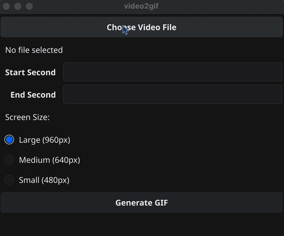

## Install

1. Install ffmpeg: `brew install ffmpeg`
2. Download the [latest release zip file](https://github.com/alexandremcosta/video2gif/releases)
3. Extract the zip file
4. Move the .app file to `Applications/` folder

## Demo


## Build

#### Install Go
```sh
brew install go
```


#### Create a Go module

```sh
go mod init video2gif
go mod tidy
```

#### Install Fyne CLI

```sh
go install fyne.io/tools/cmd/fyne@latest
export PATH="$PATH:$(go env GOPATH)/bin"
```

#### Build .app bundle

```sh
fyne package -os darwin -icon icon.png -name video2gif
```
